# VAR & ARIMA Modeling and Forecasting

In this post, I show the basic steps in R for creating Vector
Autoregressive (VAR) and Autoregressive Integrated Moving Average
(ARIMA) models, and forecasting those models. I will skip over the math
for this post but understand that these models and subsequent
forecasting includes complexities that you should grasp before making
decisions based on the results of these models. You can read about the
art of forecasting, including a lot more math,
[here](https://www.sas.upenn.edu/~fdiebold/Teaching221/BookPhotocopy.pdf)
and [here](https://otexts.com/fpp2/VAR.html). Special thanks to
Professor Timothy Duy for showing me some of these resources and
providing the foundation for this example.

# VAR Model & Forecast

### Load in packages

    ## Install the pacman package if necessary
    if (!require("pacman")) install.packages("pacman")
    ## Install other packages using pacman::p_load()
    pacman::p_load(fredr, dplyr, tseries, ggplot2, ggpubr, forecast, vars)

### Load in data

-   You will need to obtain an API key through
    [FRED](https://fred.stlouisfed.org/docs/api/api_key.html).
-   Set your API key in your .Renviron by calling
    `usethis::edit_r_environ()` and then adding
    FRED\_API\_KEY=“your-api-key”
-   Call `readRenviron("~/.Renviron")` or restart your R session to
    activate the API key
-   Alternatively, call `fredr_set_key("your-api-key")`, but this will
    only set it for your current session
-   Use `fredr` package to dictate which series you would like to load
    in. Today, we will use the series for temporary employees and
    overall employment in the United States. **Note: I am choosing to
    load in the data for 1990 to the most recent data. We can choose a
    subset of this to estimate our model over and then forecast over
    “known” periods.**

<!-- -->

    # load in data with fredr
    # overall employment
    emp = fredr(
      series_id = "PAYEMS",
      observation_start = as.Date("1990-01-01"),
      observation_end = as.Date("2022-4-01")
    )

    # temporary help
    temphelp = fredr(
      series_id = "TEMPHELPS",
       observation_start = as.Date("1990-01-01"),
      observation_end = as.Date("2022-4-01")
    )

    # recession data 
    rec = fredr(
      series_id = "USRECM",
       observation_start = as.Date("1990-01-01"),
      observation_end = as.Date("2022-04-01")
    )

### Create `ts` objects

-   To be able to create ARIMA and VAR models, R has to recognize these
    series as time series objects. We use the `ts()` function that is
    part of the `stats` packge to do this.
-   I think creating a new data frame from the original FRED data frame
    that we created in the previous make modifying the date ranges for
    your models easier, if need be. I have created `emp1` and will turn
    `emp1` into a ts object by setting the start and end dates mannually
    because I do not want estimate my VAR model over the entire series
    length. If you did not set start and end, then `ts()` defaults to
    the whole series.
-   Setting `frequency` should be specified. This is monthly data so I
    have set it to 12.
-   I am estimating the VAR model over the period January 1990 to
    December 2017 for simplicity in this example.

<!-- -->

    # create an overall employment time series object
    emp1 = emp |>
      subset(select = c(date, value)) # select only necessary variables

    emp1 = ts(emp1[,2], # select the value column
              start = c(1990,1),  # set start of the series 
              end = c(2017,12),
              frequency = 12) # data is released every month

    # create an temphelps time series object
    temphelp1 = temphelp |>
      subset(select = c(date, value)) # select only necessary variables

    temphelp1 = ts(temphelp1[,2], # select the value column
              start = c(1990,1),  # set start of the series 
              end = c(2017,12),
              frequency = 12) # data is released every month

### Examine series

-   A necessary part of forecasting and creating AR models is to examine
    the series of interest. Today, I will compare the built-in
    functionality of `autoplot` with `ggplot2`

<!-- -->

    # autoplot ONLY USE WITH TS OBJECTS
    autoplot(emp1)

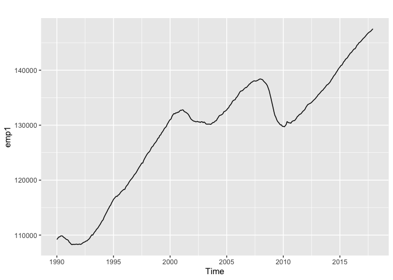

    autoplot(temphelp1)

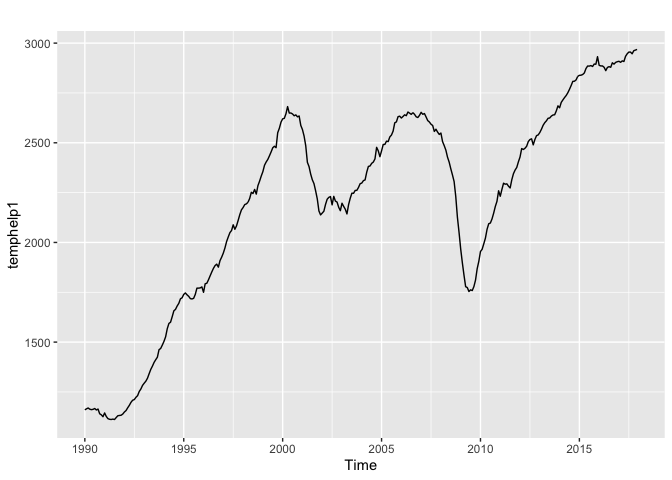

Those graphs are okay… but let’s up the ante a bit with `ggplot2`.

    # ggplot version USE ORIGINAL DATAFRAME

    min <- as.Date("1990-01-01")
    max <- as.Date("2022-04-01")
    g_emp = ggplot(data = emp) + 
      geom_line(aes(x = date, y = value)) + 
      scale_x_date(date_breaks = "2 years", date_labels = "%Y", limits=c(min,max)) +
      labs(y = "Employees (000s)", x= "Time", title = "Total Nonfarm Employment", subtitle = "January 1990 - April 2022") +
      theme_bw() + theme(axis.text.x = element_text(angle = 60, hjust = 1)) +
      geom_rect(aes(xmin = as.Date("1990-07-01"), xmax = as.Date("1991-03-01"), ymin=-Inf, ymax=+Inf), 
                fill = 'lightpink', alpha = 0.01) +
      geom_rect(aes(xmin = as.Date("2001-03-01"), xmax = as.Date("2001-11-01"), ymin=-Inf, ymax=+Inf), 
                fill = 'lightpink', alpha = 0.01) +
      geom_rect(aes(xmin = as.Date("2007-12-01"), xmax = as.Date("2009-06-01"), ymin=-Inf, ymax=+Inf), 
                fill = 'lightpink', alpha = 0.01) +
       geom_rect(aes(xmin = as.Date("2020-02-01"), xmax = as.Date("2020-04-01"), ymin=-Inf, ymax=+Inf), 
                fill = 'lightpink', alpha = 0.01) 

    g_temp = ggplot(data = temphelp) + 
      geom_line(aes(x = date, y = value)) + 
      scale_x_date(date_breaks = "2 years", date_labels = "%Y", limits=c(min,max)) +
      labs(y = "", x= "Time", title = "Temporary Employment", subtitle = "January 1990 - April 2022") +
      theme_bw() + theme(axis.text.x = element_text(angle = 60, hjust = 1)) +
      geom_rect(aes(xmin = as.Date("1990-07-01"), xmax = as.Date("1991-03-01"), ymin=-Inf, ymax=+Inf), 
                fill = 'lightpink', alpha = 0.01) +
      geom_rect(aes(xmin = as.Date("2001-03-01"), xmax = as.Date("2001-11-01"), ymin=-Inf, ymax=+Inf), 
                fill = 'lightpink', alpha = 0.01) +
      geom_rect(aes(xmin = as.Date("2007-12-01"), xmax = as.Date("2009-06-01"), ymin=-Inf, ymax=+Inf), 
                fill = 'lightpink', alpha = 0.01) +
       geom_rect(aes(xmin = as.Date("2020-02-01"), xmax = as.Date("2020-04-01"), ymin=-Inf, ymax=+Inf), 
                fill = 'lightpink', alpha = 0.01) 

    ggarrange(g_emp, g_temp)

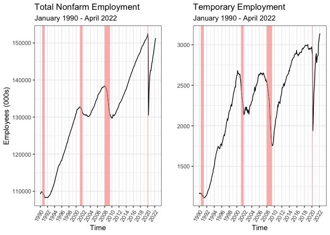

Temporary employment peaks before a recession while overall employment
peaks during a recession which indicates that a decrease in temporary
employment could be a signal that a recession is arriving.

### Test for unit root and transform

-   An important part of understanding the dynamics of a time series is
    knowing whether or not it has a unit root (sometimes referred to as
    cointegration). I suggest you read the chapter dedicated to unit
    roots in the book I linked or here’s a [brief
    intro](https://faculty.washington.edu/ezivot/econ584/notes/unitroot.pdf).
-   I will use an Augmented Dickey-Fuller test to determine the level of
    cointegration coupled with the `ndiffs()` function that
    automatically shows you the level of cointegration in the series.
    The null hypothesis for the ADF test is that non-stationarity
    exists, i.e. the series has a unit root.
-   The `diff()` can be implemented to eliminate the unit root.
-   Then, I perform another ADF test on the first-differenced data.
    Overall employment still shows non-stationarity, as evidenced by
    accepting the null hypothesis.
-   Additionally, I wanted to examine the degree of autocorrelation in
    the differenced series using the Ljung–Box test.

<!-- -->

    # augmented dickey-fuller cointegration test
    ndiffs(temphelp1, test = 'adf')

    ## [1] 1

    ndiffs(emp1, test = 'adf')

    ## [1] 1

    # tranform series by taking the first-difference
    diff_temphelp1 = diff(temphelp1)
    diff_emp1 = diff(emp1)

    # check to ensure that the unit root is no longer there 
    adf.test(diff_temphelp1)

    ## 
    ##  Augmented Dickey-Fuller Test
    ## 
    ## data:  diff_temphelp1
    ## Dickey-Fuller = -4.2061, Lag order = 6, p-value = 0.01
    ## alternative hypothesis: stationary

    adf.test(diff_emp1)

    ## 
    ##  Augmented Dickey-Fuller Test
    ## 
    ## data:  diff_emp1
    ## Dickey-Fuller = -2.8629, Lag order = 6, p-value = 0.2126
    ## alternative hypothesis: stationary

    # look at patterns of non-stationarity
    Box.test(diff_emp1, lag = 10, type = "Ljung-Box")

    ## 
    ##  Box-Ljung test
    ## 
    ## data:  diff_emp1
    ## X-squared = 1395.5, df = 10, p-value < 2.2e-16

    Box.test(diff_temphelp1, lag = 10, type = "Ljung-Box")

    ## 
    ##  Box-Ljung test
    ## 
    ## data:  diff_temphelp1
    ## X-squared = 477.24, df = 10, p-value < 2.2e-16

### Select number of lags and estimate model

-   Here, I will use the TEMPHELPS and PAYEMS in levels rather than the
    differenced data. You can run VAR and ARIMA models using differenced
    data but you have to return it to levels after forecasting for any
    interpretability. Here’s a [good
    resource](https://www.r-bloggers.com/2021/11/vector-autoregressive-model-var-using-r/)
    on how to do that.
-   You have to create a matrix of the time series objects to run the
    lag selection procedure and model estimation.
-   There are many ways of selecting the number of lags in a model,
    including just looking at the ACF and PACF, but here I will choose
    whatever the AIC selects from the `VARselect()` function in the
    `vars` package. I specify that the selection and model estimation
    should be on a “trend” because both temporary and overall employment
    are increasing on a trend.
-   Then, I estimate the model using `VAR()`, also in the `vars`
    package.

<!-- -->

    # create one dataframe with both series to estimate models on
    temp_emp = cbind(emp1, temphelp1)
    colnames(temp_emp) = c("emp1", "temphelp1")

    # select lag length
    lagselect = VARselect(temp_emp, lag.max = 10, type = "trend")
    lagselect$selection

    ## AIC(n)  HQ(n)  SC(n) FPE(n) 
    ##      8      4      3      8

    # estimate model 
    mod1 = VAR(temp_emp, p = 8, type = "trend")
    summary(mod1)

    ## 
    ## VAR Estimation Results:
    ## ========================= 
    ## Endogenous variables: emp1, temphelp1 
    ## Deterministic variables: trend 
    ## Sample size: 328 
    ## Log Likelihood: -3368.618 
    ## Roots of the characteristic polynomial:
    ##     1 0.9668 0.9668 0.754 0.754 0.7511 0.7511 0.7466 0.7466 0.7418 0.7332 0.7332 0.6833 0.6833 0.5808 0.5808
    ## Call:
    ## VAR(y = temp_emp, p = 8, type = "trend")
    ## 
    ## 
    ## Estimation results for equation emp1: 
    ## ===================================== 
    ## emp1 = emp1.l1 + temphelp1.l1 + emp1.l2 + temphelp1.l2 + emp1.l3 + temphelp1.l3 + emp1.l4 + temphelp1.l4 + emp1.l5 + temphelp1.l5 + emp1.l6 + temphelp1.l6 + emp1.l7 + temphelp1.l7 + emp1.l8 + temphelp1.l8 + trend 
    ## 
    ##              Estimate Std. Error t value Pr(>|t|)    
    ## emp1.l1       1.24905    0.06556  19.052   <2e-16 ***
    ## temphelp1.l1  0.74228    0.40348   1.840   0.0668 .  
    ## emp1.l2      -0.03493    0.10077  -0.347   0.7291    
    ## temphelp1.l2  0.05471    0.59083   0.093   0.9263    
    ## emp1.l3      -0.11829    0.10100  -1.171   0.2425    
    ## temphelp1.l3 -0.45553    0.59147  -0.770   0.4418    
    ## emp1.l4      -0.15998    0.10097  -1.584   0.1141    
    ## temphelp1.l4  0.74558    0.59234   1.259   0.2091    
    ## emp1.l5       0.10693    0.10057   1.063   0.2885    
    ## temphelp1.l5 -0.50996    0.59300  -0.860   0.3905    
    ## emp1.l6       0.12904    0.10030   1.287   0.1992    
    ## temphelp1.l6 -0.82015    0.59384  -1.381   0.1682    
    ## emp1.l7      -0.11584    0.10055  -1.152   0.2502    
    ## temphelp1.l7 -0.63181    0.59406  -1.064   0.2884    
    ## emp1.l8      -0.05564    0.06274  -0.887   0.3759    
    ## temphelp1.l8  0.85692    0.39540   2.167   0.0310 *  
    ## trend         0.06185    0.12752   0.485   0.6280    
    ## ---
    ## Signif. codes:  0 '***' 0.001 '**' 0.01 '*' 0.05 '.' 0.1 ' ' 1
    ## 
    ## 
    ## Residual standard error: 112.9 on 311 degrees of freedom
    ## Multiple R-Squared:     1,   Adjusted R-squared:     1 
    ## F-statistic: 2.543e+07 on 17 and 311 DF,  p-value: < 2.2e-16 
    ## 
    ## 
    ## Estimation results for equation temphelp1: 
    ## ========================================== 
    ## temphelp1 = emp1.l1 + temphelp1.l1 + emp1.l2 + temphelp1.l2 + emp1.l3 + temphelp1.l3 + emp1.l4 + temphelp1.l4 + emp1.l5 + temphelp1.l5 + emp1.l6 + temphelp1.l6 + emp1.l7 + temphelp1.l7 + emp1.l8 + temphelp1.l8 + trend 
    ## 
    ##               Estimate Std. Error t value Pr(>|t|)    
    ## emp1.l1       0.030019   0.010738   2.796   0.0055 ** 
    ## temphelp1.l1  1.125225   0.066085  17.027   <2e-16 ***
    ## emp1.l2      -0.023922   0.016505  -1.449   0.1482    
    ## temphelp1.l2  0.085331   0.096771   0.882   0.3786    
    ## emp1.l3      -0.012909   0.016543  -0.780   0.4358    
    ## temphelp1.l3 -0.116722   0.096875  -1.205   0.2292    
    ## emp1.l4       0.002123   0.016538   0.128   0.8979    
    ## temphelp1.l4 -0.023028   0.097018  -0.237   0.8125    
    ## emp1.l5       0.001793   0.016472   0.109   0.9134    
    ## temphelp1.l5  0.046518   0.097127   0.479   0.6323    
    ## emp1.l6       0.008950   0.016428   0.545   0.5863    
    ## temphelp1.l6 -0.126151   0.097264  -1.297   0.1956    
    ## emp1.l7      -0.010508   0.016469  -0.638   0.5239    
    ## temphelp1.l7 -0.124062   0.097300  -1.275   0.2032    
    ## emp1.l8       0.004675   0.010277   0.455   0.6495    
    ## temphelp1.l8  0.116730   0.064762   1.802   0.0724 .  
    ## trend         0.041000   0.020886   1.963   0.0505 .  
    ## ---
    ## Signif. codes:  0 '***' 0.001 '**' 0.01 '*' 0.05 '.' 0.1 ' ' 1
    ## 
    ## 
    ## Residual standard error: 18.5 on 311 degrees of freedom
    ## Multiple R-Squared: 0.9999,  Adjusted R-squared: 0.9999 
    ## F-statistic: 2.935e+05 on 17 and 311 DF,  p-value: < 2.2e-16 
    ## 
    ## 
    ## 
    ## Covariance matrix of residuals:
    ##            emp1 temphelp1
    ## emp1      12755    1090.2
    ## temphelp1  1090     342.2
    ## 
    ## Correlation matrix of residuals:
    ##             emp1 temphelp1
    ## emp1      1.0000    0.5219
    ## temphelp1 0.5219    1.0000

### Statistical checks on the model

-   Run a Breush-Godfrey test to ensure that we have eliminated any
    autocorrelation in the residuals. In this case, we accept the null
    hypothesis of no serial correlation because the p-value > 0.05
-   Ensure that the model is stable (again, go read about this if you
    are unsure). I plotted the results from the stability test as well
    as used the `roots()` function from `vars`. It appears that our
    model is not stable. This is not good, but I will continue forward
    for this example.
-   The Jacques-Bera test shows whether or not the residuals come from a
    normal distribution. In this case we reject the null hypothesis of
    noraml distribution – not the end of the world but has some
    consequences.

<!-- -->

    # ensure no time dependence in residuals
    serial.test(mod1, lags.pt = 8, type = "BG")

    ## 
    ##  Breusch-Godfrey LM test
    ## 
    ## data:  Residuals of VAR object mod1
    ## Chi-squared = 24.728, df = 20, p-value = 0.212

    # ensure stability
    plot(stability(mod1, type = "OLS-CUSUM"))

    roots(mod1, modulus = TRUE)

    ##  [1] 1.0004234 0.9668045 0.9668045 0.7539549 0.7539549 0.7510879 0.7510879
    ##  [8] 0.7466168 0.7466168 0.7417747 0.7332283 0.7332283 0.6832905 0.6832905
    ## [15] 0.5808413 0.5808413

    # ensure normally distributed residuals 
    normality.test(mod1, multivariate.only = TRUE)

    ## $JB
    ## 
    ##  JB-Test (multivariate)
    ## 
    ## data:  Residuals of VAR object mod1
    ## Chi-squared = 31.009, df = 4, p-value = 3.048e-06
    ## 
    ## 
    ## $Skewness
    ## 
    ##  Skewness only (multivariate)
    ## 
    ## data:  Residuals of VAR object mod1
    ## Chi-squared = 0.89107, df = 2, p-value = 0.6405
    ## 
    ## 
    ## $Kurtosis
    ## 
    ##  Kurtosis only (multivariate)
    ## 
    ## data:  Residuals of VAR object mod1
    ## Chi-squared = 30.118, df = 2, p-value = 2.883e-07

### Granger causality

-   Granger causality basically tells us which variable contains
    information about the other variable with time as dimension. This
    type of test (an F-test) can be very useful in policymaking because
    you can use one variable as a ‘signal’ for another variable.
-   The `causality()` function in `vars` does this for us. X causes Y if
    the p-value &lt; 0.05
-   In our case, overal employment Granger causes temporary employment,
    and temporary employment Granger causes overall employment over our
    model time period (1990-2017)

<!-- -->

    # use  model to understand Granger Causality
    causality(mod1, cause = "emp1")

    ## $Granger
    ## 
    ##  Granger causality H0: emp1 do not Granger-cause temphelp1
    ## 
    ## data:  VAR object mod1
    ## F-Test = 2.1632, df1 = 8, df2 = 622, p-value = 0.02858
    ## 
    ## 
    ## $Instant
    ## 
    ##  H0: No instantaneous causality between: emp1 and temphelp1
    ## 
    ## data:  VAR object mod1
    ## Chi-squared = 70.207, df = 1, p-value < 2.2e-16

    causality(mod1, cause = "temphelp1")

    ## $Granger
    ## 
    ##  Granger causality H0: temphelp1 do not Granger-cause emp1
    ## 
    ## data:  VAR object mod1
    ## F-Test = 4.1154, df1 = 8, df2 = 622, p-value = 8.453e-05
    ## 
    ## 
    ## $Instant
    ## 
    ##  H0: No instantaneous causality between: temphelp1 and emp1
    ## 
    ## data:  VAR object mod1
    ## Chi-squared = 70.207, df = 1, p-value < 2.2e-16

### Impulse response functions

-   We should also look at the impulse response functions to better
    understand the degree of impact that a shock to one variable has on
    the other.
-   I chose `n.ahed = 24` to look at the dynamics of a shock 2 years
    after it hits

<!-- -->

    a = irf(mod1, impulse = "emp1", response = "emp1", n.ahead = 24, boot = TRUE)
    plot(a, ylab = "Employment", main = "EMP's shock to EMP")

    b = irf(mod1, impulse = "emp1", response = "temphelp1", n.ahead = 24, boot = TRUE)
    plot(b, ylab = "TEMPHELPS", main = "EMP's shock to TEMPHELPS")

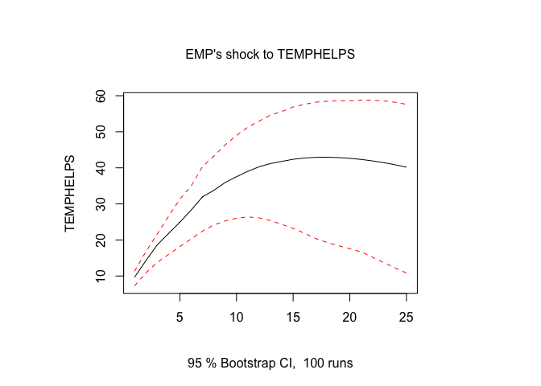

    c = irf(mod1, impulse = "temphelp1", response = "emp1", n.ahead = 24, boot = TRUE)
    plot(c, ylab = "Employment", main = "TEMPHELPS's shock to EMP")

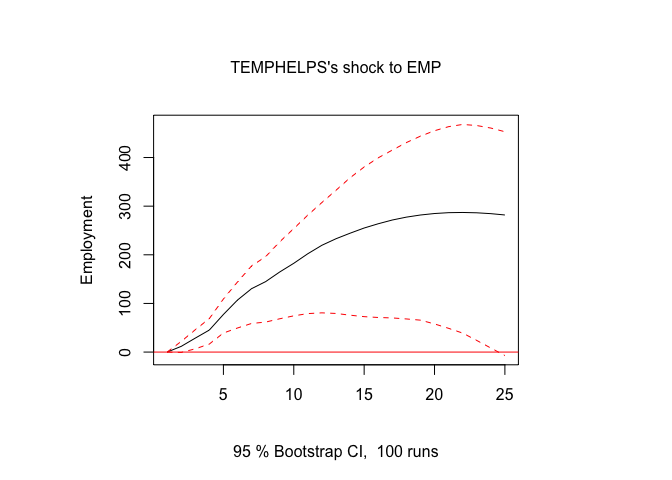

    d = irf(mod1, impulse = "temphelp1", response = "temphelp1", n.ahead = 24, boot = TRUE)
    plot(d, ylab = "Employment", main = "TEMPHELPS's shock to TEMPHELPS")

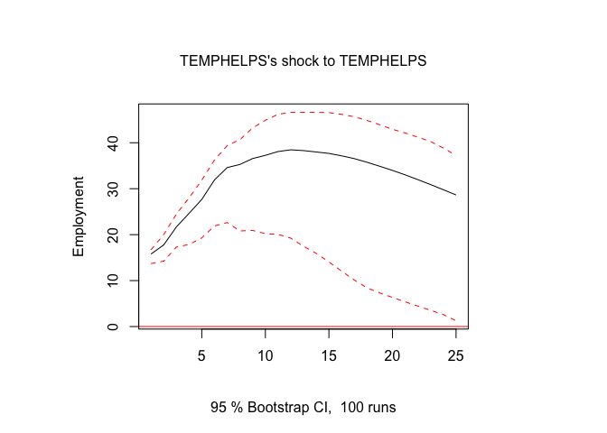

A shock to PAYEMS causes a persistent increase in PAYEMS and TEMPHELPS,
and a shock to TEMPHELPS causes a persistent shock to PAYEMS and
TEMPHELPS. This shows the unit root dynamic in both of these series and
the business cycle dynamics. These IRFs show evidence that a shock to
temporary hires signals that overall employment will be shocked as well.

### Forecast

-   Use the `forecast()` function on the model created in the previous
    step and set your forecast horizon. Here I set the horizon to `h=52`
    because I want to forecast out to April 2022.
-   I use `autoplot()` here for simplicity. Examine the object that the
    `forecast()` function creates – it is a list so you have to use
    “\[\[\]\]” notation to extract the relevant information.
-   To compare the forecasted values with the actual series, I have
    created new series called `temphelp2` and `emp2` that contain data
    up to April 2022. Then, I add them to the graph by using
    `autolayer()`

<!-- -->

    varfst = forecast(mod1, h = 52)
    autoplot(varfst)

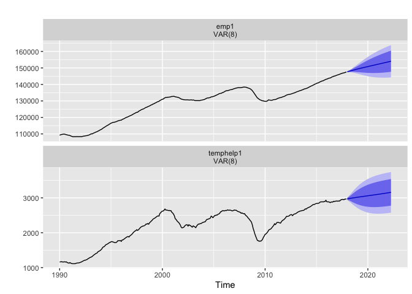

    # overlay actual values with forecasted values
    # create an overall employment time series object
    emp2 = emp |>
      subset(select = c(date, value)) # select only necessary variables

    emp2 = ts(emp2[,2], # select the value column
              start = c(1990,1),  # set start of the series 
              end = c(2022,4),
              frequency = 12) # data is released every month

    # create an temphelps time series object
    temphelp2 = temphelp |>
      subset(select = c(date, value)) # select only necessary variables

    temphelp2 = ts(temphelp2[,2], # select the value column
              start = c(1990,1),  # set start of the series 
              end = c(2022,4),
              frequency = 12) # data is released every month

    autoplot(varfst[["forecast"]][["emp1"]]) + autolayer(emp2)

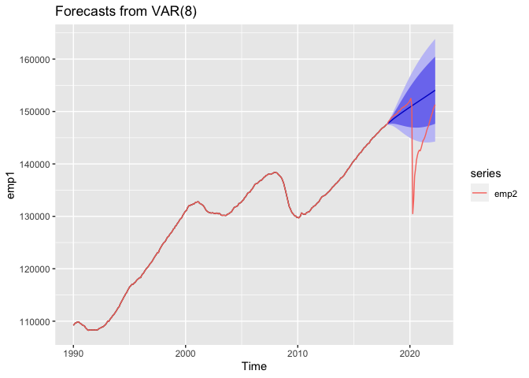

    autoplot(varfst[["forecast"]][["temphelp1"]]) + autolayer(temphelp2)

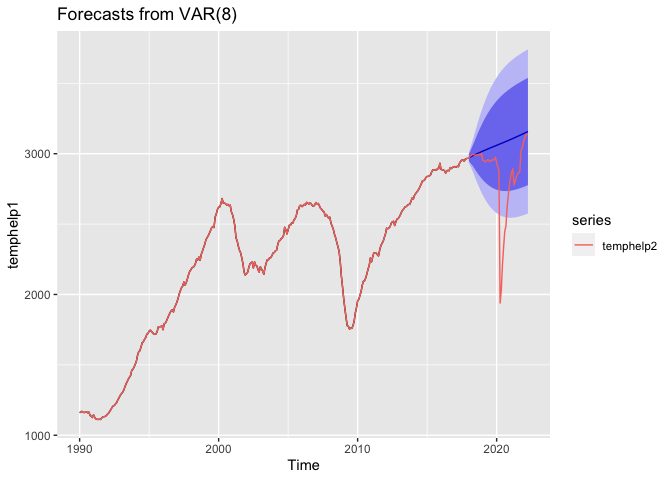

# ARIMA Model & Forecast

Another common forecasting model is the ARIMA model. Here I use an ARIMA
model to forecast Oregon’s employment levels into 2024.

### Load in data and transform

Following the same proceduare as before, I load in all the relevant data
and then create the `ts()` subsetted to the timeframe I want to use to
build the model. Because I am forecasting over an unknown time period,
June 2022 to April 2024, I use all the data loaded to run my model.

    # load in ORNA series
    orna = fredr(
      series_id = "ORNA",
      observation_start = as.Date("1990-01-01"),
      observation_end = as.Date("2022-04-01")
    )

    # create an orna time series object
    orna1 = orna |>
      subset(select = c(date, value)) # select only necessary variables

    orna1 = ts(orna1[,2], # select the value column
              start = c(1990,1),  # set start of the series January 2000
              end = c(2022,4 ),
              frequency = 12) # data is released every month

### Check unit roots

-   The “I” in ARIMA stands for “integrated” so the whole point of
    creating an ARIMA model is to leverage the unit root of the data in
    the creation of the forecast.
-   To check for a unit root, I follow the same procedure as above:
    `ndiffs()` with an ADF test.
-   Then, I examine the autocorrelation in the first-differenced data
    and plot the first-differenced data using `ggtdisplay()`

<!-- -->

    ndiffs(orna1, test = "adf")

    ## [1] 1

    Box.test(diff(orna1), lag = 10, type = "Ljung-Box")

    ## 
    ##  Box-Ljung test
    ## 
    ## data:  diff(orna1)
    ## X-squared = 16.151, df = 10, p-value = 0.09539

    orna1 |> diff() |> ggtsdisplay(main="First-Difference of ORNA Series and Autocorrelations")

The p-value &gt; 0.05 for the Ljung-Box test shows that the series does
not exhibit autocorrelations. However, we could reject the null
hypothesis at the 10% level, I decided to look at the ACF and PACF for
the series which shows some autocorrelation. This is likely due to the
dynamics during the pandemic but because it is not highly statistically
significant, we will stick to using the first-differenced data, rather
than using two lags.

### Create an ARIMA model

-   The `forecast` packages comes with an easy function `auto.arima()`.
    There is a manual ARIMA function: `Arima()` if you want to set your
    own (p,d,q) – it is also part of the `forecast` package.
-   With `auto.arima()`, you set the level of cointegration using
    `d = 1`. `auto.arima()` chose an ARIMA(0,1,2) model based on the
    model that minimized the AIC criteria.
-   Then, I check the residuals for autocorrelation and whether the
    residuals come from a normal distribution.

<!-- -->

    arima = auto.arima(orna1, d = 1)
    checkresiduals(arima)

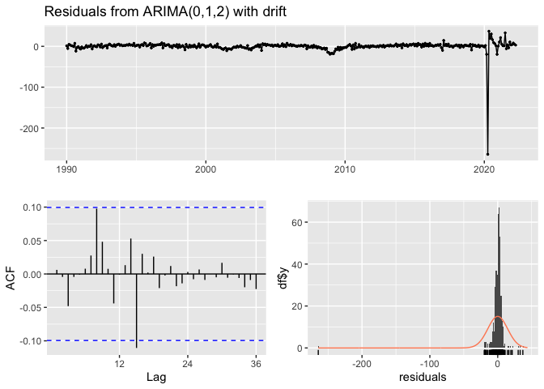

    ## 
    ##  Ljung-Box test
    ## 
    ## data:  Residuals from ARIMA(0,1,2) with drift
    ## Q* = 14.086, df = 21, p-value = 0.8659
    ## 
    ## Model df: 3.   Total lags used: 24

The residuals do not exhibit autocorrelation and they appear to be
relatively normally distributed.

### Forecast

-   Use the `forecast()` function again to forecast out two years of
    employment.

<!-- -->

    arimafst = forecast(arima, h = 24)
    autoplot(arimafst)

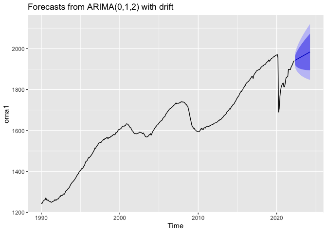

# Conclusion

R has a litany of tools to conduct time series analysis and forecasting.
I have presented the basic set of functions and their implementations to
create a VAR and ARIMA model. Before moving forward in creating your
models and forecasts, I suggest reading the resources I have linked.
Happy forecasting!

## Other resources:

[A Deep Dive on Vector Autoregression in
R](https://towardsdatascience.com/a-deep-dive-on-vector-autoregression-in-r-58767ebb3f06)  
[Use geom\_rect() to add recession bars to your time series
plots](https://www.r-bloggers.com/2011/08/use-geom_rect-to-add-recession-bars-to-your-time-series-plots-rstats-ggplot/)  
[Autoplot
Methods](https://cran.r-project.org/web/packages/ggspectra/vignettes/userguide2-autoplot-methods.html)  
[Forecast Package
Vignette](https://cran.r-project.org/web/packages/forecast/forecast.pdf)  
[More on Statistical
Tests](https://towardsdatascience.com/statistical-test-for-time-series-a57d9155d09b)
